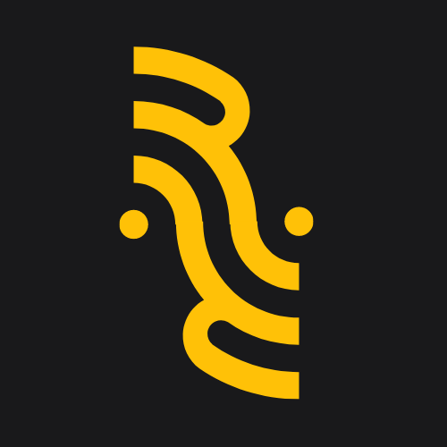

 
 
  
 

# :microphone: Resonate - An Open Source Social Voice Platform

<a href="https://vercel.com/?utm_source=AOSSIE-org&utm_campaign=oss" target="_blank" rel="noreferrer noopener" aria-label="Powered by Vercel">

  
</a>  

  

 

  

With the rising popularity of social voice platforms such as Clubhouse and Twitter Spaces, it is high time for an Open Source alternative. A platform like this would not only enhance credibility within the open-source community but also attract more users and foster growth. An engagement platform that is Open Source has the potential to drive significant traction and help establish a strong presence.

## :rocket: Features
1. Real-time Audio Communication by joining rooms and talking to people.
2. Ability to create rooms and moderate speakers and events.
3. Pair chatting to enable users to find random partners to talk to in the app.
4. Real-time messaging(Coming Soon) 

## :computer: Technologies Used

1.  **Flutter** - Mobile application
2.  **Appwrite** - Authentication, Database for Room and Participant management, Storage for user/group data
3.  **NodeJS** - REST API to talk to Livekit & Appwrite
4.  **LiveKit** - Web Real-Time Communication 

## :link: Repository Links
1. [Resonate Flutter App](https://github.com/AOSSIE-Org/Resonate)
2. [Resonate Backend](https://github.com/AOSSIE-Org/Resonate-Backend)

## :mag_right: High Level Architecture

## :movie_camera: App Screenshots

 
| Login Screen | Home Screen | Create Room Screen |
| :---         |     :---      |          :--- |
|   |     |     |

| Room Screen | Profile Screen | Pairchat Screen |
| :---         |     :---      |          :--- |
|   |    |      |

## :raised_hands: Contributing
:star: Don't forget to star this repository if you find it useful! :star:

Thank you for considering contributing to this project! Contributions are highly appreciated and welcomed. To ensure a smooth collaboration, Refer to the [Contribution Guidelines](https://github.com/AOSSIE-Org/Resonate/blob/master/CONTRIBUTING.md).

## :v: Maintainers

-   [Jaideep Prasad](https://github.com/jddeep)
-   [Chandan S. Gowda](https://github.com/chandansgowda)

## :mailbox: Communication Channels

If you have any questions, need clarifications, or want to discuss ideas, feel free to reach out through the following channels:

-   [Discord Server](https://discord.com/invite/6mFZ2S846n)
-   [Email](mailto:aossie.oss@gmail.com)

<!-- License -->
## :round_pushpin: License

Distributed under the [GNU General Public License](https://opensource.org/license/gpl-3-0/). See [LICENSE](https://github.com/AOSSIE-Org/Resonate/blob/master/LICENSE) for more information.

We appreciate your contributions and look forward to working with you to make this project even better!

By following these guidelines, we can maintain a productive and collaborative open-source environment. Thank you for your support!
