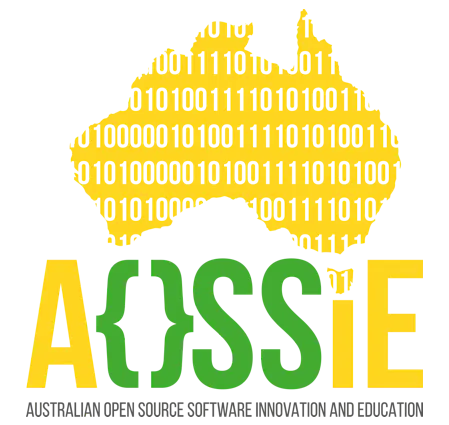

<div align="center">
 <span>
 

 </span>

# 🎙️ Resonate - Open Source Social Voice Platform

**An innovative open-source platform for voice-based social interactions, storytelling, and real-time audio communication**

</div>

<div align="center" style="text-align:center;"> 
<span>
 <a href="https://appwrite.io" target="_blank">
  <picture>
   <source media="(prefers-color-scheme: dark)" align="center" srcset="https://github.com/appwrite/website/blob/main/static/images/logos/appwrite.svg"      
    alt="Appwrite Logo" width="200">
   
  </picture>
 </a>
 &nbsp;&nbsp;&nbsp;&nbsp;&nbsp;&nbsp;&nbsp;&nbsp;
 <a href="https://livekit.io" target="_blank">
  <picture>
   <source media="(prefers-color-scheme: dark)" align="center" srcset="https://github.com/AKASHANGADII/Resonate/assets/81625153/87bb173f-d5b0-4386-b9ca-6e69cd53578f" alt="Livekit Logo" width="140" height="30">
   
  </picture>
 </a>
</span>
</div>

<br>

<div align="center">
  
[](https://opensource.org/license/gpl-3-0/)
[](https://github.com/AOSSIE-Org/Resonate/stargazers)
[](https://github.com/AOSSIE-Org/Resonate/network/members)
[](https://play.google.com/store/apps/details?id=com.resonate.resonate)

[](https://github.com/AOSSIE-Org/Resonate/blob/master/CONTRIBUTING.md)
[](https://github.com/AOSSIE-Org/Resonate/graphs/contributors)
[](https://discord.gg/MMZBadkYFm)
[](https://flutter.dev/)

</div>

---

## 📖 Table of Contents

- [About Resonate](#-about-resonate)
- [Key Features](#-key-features)
- [Technology Stack](#-technology-stack)
- [Getting Started](#-getting-started)
- [Project Structure](#-project-structure)
- [Contributing](#-contributing)
- [Community Guidelines](#-community-guidelines)
- [Play Store Presence](#️-play-store-feature-graphic)
- [Screenshots](#-app-screenshots)
- [Maintainers](#-maintainers)
- [Communication](#-communication-channels)
- [License](#-license)
- [Contributors](#-thanks-to-all-contributors)

---

## 🌟 About Resonate

**Resonate** is a revolutionary open-source social voice platform that brings the power of voice-based communication to the forefront of social interaction. Inspired by platforms like Clubhouse, Twitter Spaces, and Spotify, Resonate creates a unique ecosystem where users can:

- 🎭 **Share immersive audio stories** with synchronized lyrics and chapter-based narratives
- 💬 **Engage in real-time live discussions** through audio rooms
- 🤝 **Connect through pair chats** and voice calls with friends
- 📅 **Schedule and host audio events** with community notifications
- 🎨 **Customize their experience** with multiple theme options

Built with Flutter and powered by Appwrite and LiveKit, Resonate represents the next generation of voice-first social platforms, fostering innovation while maintaining complete transparency and openness through its open-source nature.

### 🎯 Vision

To democratize voice-based social interaction by creating an accessible, feature-rich, and community-driven platform that puts users and contributors first.

---

## 🚀 Key Features

### 🎪 Audio Rooms & Live Events
- **Create & Moderate Audio Rooms**: Host live audio discussions with full moderation controls
- **Real-time Audio Communication**: Join rooms and engage in high-quality voice conversations
- **Scheduled Rooms**: Plan events in advance and notify subscribers automatically
- **Speaker Management**: Control who can speak, manage requests, and moderate discussions

### 📚 Story Platform (In Development)
- **Chapter-Based Stories**: Create and publish audio stories organized into chapters
- **Synchronized Lyrics**: Display lyrics in real-time as stories play
- **Creator Profiles**: Follow your favorite creators and get notified of new releases
- **Story Catalog**: Browse through an extensive library of user-generated content
- **Immersive Player**: Beautiful, feature-rich audio player with advanced controls

### 👥 Social Connections
- **Pair Chat**: Discover and connect with random people for one-on-one conversations
- **Friend System**: Add friends and maintain your social network (Coming Soon)
- **Voice Calls**: Direct voice calling with friends (Coming Soon)
- **Real-time Messaging**: Chat with friends through instant messaging (Coming Soon)
- **Profile Customization**: Personalize your profile and showcase your personality

### 🎨 Customization & Themes
- **Multiple Theme Options**: Choose from Forest, Time, Cream, Amber, and Vintage themes
- **Dark/Light Mode**: Seamless switching between display modes
- **Responsive Design**: Beautiful UI that adapts to different screen sizes
- **Accessibility Features**: Built with inclusivity in mind

---

## 💻 Technology Stack

### Frontend
- **Framework**: [Flutter](https://flutter.dev/) - Cross-platform mobile development
- **State Management**: GetX - Reactive state management solution
- **UI Components**: Custom-built, theme-aware widgets
- **Localization**: Multi-language support with flutter_localizations

### Backend & Services
- **Backend as a Service**: [Appwrite](https://appwrite.io/)
  - Authentication & User Management
  - Cloud Database (NoSQL)
  - Cloud Storage for media files
  - Cloud Functions for serverless operations
- **Real-time Communication**: [LiveKit](https://livekit.io/)
  - WebRTC-based audio streaming
  - Low-latency voice communication
  - Room management and moderation

### Development Tools
- **Version Control**: Git & GitHub
- **CI/CD**: GitHub Actions (planned)
- **Code Quality**: Dart analyzer, flutter_lints
- **Documentation**: Dartdoc for API documentation

---

## 🎯 Getting Started

### Prerequisites

Before you begin, ensure you have the following installed:

- **Flutter SDK** (3.0 or higher) - [Installation Guide](https://docs.flutter.dev/get-started/install)
- **Dart SDK** (included with Flutter)
- **Android Studio** or **VS Code** with Flutter extensions
- **Git** for version control
- **A device or emulator** for testing

### Quick Start Guide

#### 1️⃣ Clone the Repository

```bash
git clone https://github.com/AOSSIE-Org/Resonate.git
cd Resonate
```

#### 2️⃣ Install Dependencies

```bash
flutter pub get
```

#### 3️⃣ Complete Setup

Resonate requires proper configuration of Appwrite and LiveKit services. We've created a comprehensive guide to help you:

📘 **[Follow the Detailed Onboarding Guide](ONBOARDING.md)**

The onboarding guide includes:
- Backend environment setup (automated script available)
- Appwrite configuration and API keys
- LiveKit integration setup
- Firebase setup for push notifications
- Environment variable configuration
- Troubleshooting common issues

#### 4️⃣ Run the Application

```bash
# Run on connected device or emulator
flutter run

# Run in release mode
flutter run --release

# Run on specific device
flutter run -d <device-id>
```

### Project Setup for Contributors

For detailed contribution setup, including code style, testing, and PR guidelines, please refer to:
- 📝 [Contributing Guidelines](CONTRIBUTING.md)
- 🤝 [Code of Conduct](CODE_OF_CONDUCT.md)
- 🌍 [Translation Guidelines](TRANSLATIONS.md)

---

## 📂 Project Structure

```
Resonate/
├── android/              # Android native code
├── ios/                  # iOS native code
├── lib/
│   ├── main.dart        # Application entry point
│   ├── bindings/        # Dependency injection bindings
│   ├── controllers/     # GetX controllers (business logic)
│   ├── models/          # Data models
│   ├── routes/          # Navigation and routing
│   ├── services/        # API and backend services
│   ├── themes/          # Theme configurations
│   ├── utils/           # Utility functions and helpers
│   ├── views/           # UI screens and widgets
│   └── l10n/            # Localization files
├── assets/
│   ├── fonts/           # Custom fonts
│   ├── images/          # Image assets
│   ├── svg/             # SVG graphics
│   └── mock/            # Mock data for development
├── test/                # Unit and widget tests
├── docs/                # Documentation
├── pubspec.yaml         # Project dependencies
└── README.md            # This file
```

### Key Directories Explained

- **`controllers/`**: Contains GetX controllers managing app state and business logic
- **`services/`**: API integrations and service layer for Appwrite, LiveKit, etc.
- **`models/`**: Data models representing users, rooms, stories, etc.
- **`views/`**: All UI components, screens, and widgets
- **`utils/`**: Helper functions, constants, and utilities
- **`themes/`**: Theme definitions and styling configurations

---

## ▶️ Play Store Feature Graphic

<div align="center">


 </div>

## :movie_camera: App Screenshots

<div align="center">
 
| Login Screen (Forest)                                                                                                    | Home Screen (Time)                                                                                                      | Create Room Screen (Time)                                                                                               |
| :----------------------------------------------------------------------------------------------------------------------- | :---------------------------------------------------------------------------------------------------------------------- | :---------------------------------------------------------------------------------------------------------------------- |
|  |  |  |

| Room Screen (Cream)                                                                                                     | Profile Screen (Amber)                                                                                                  | Explore Story (Forest)                                                                                                 |
| :---------------------------------------------------------------------------------------------------------------------- | :---------------------------------------------------------------------------------------------------------------------- | :--------------------------------------------------------------------------------------------------------------------- |
|  |  |  |

| Explore Story (Amber)                                                                                                   | Theme Screen (Vintage)                                                                                                  | Upcoming Room Screen (Cream)                                                                                           |
| :---------------------------------------------------------------------------------------------------------------------- | :---------------------------------------------------------------------------------------------------------------------- | :--------------------------------------------------------------------------------------------------------------------- |
|  |  |  |

</div>


## 🤝 Contributing

We **warmly welcome** contributions from developers of all skill levels! Whether you're fixing a bug, adding a feature, improving documentation, or translating the app, your contributions make Resonate better for everyone.

### 🌟 Why Contribute?

- 🎓 Learn Flutter, Appwrite, and LiveKit in a real-world project
- 🚀 Build your portfolio with meaningful open-source contributions
- 👥 Join a welcoming community of developers
- 🌍 Make an impact on a platform used by people worldwide
- 📈 Grow your skills with code reviews and mentorship

### 🎯 How to Contribute

#### For First-Time Contributors

1. **⭐ Star this repository** to show your support
2. **🍴 Fork the repository** to your GitHub account
3. **📖 Read the guides**:
   - [Contributing Guidelines](CONTRIBUTING.md) - Detailed contribution process
   - [Onboarding Guide](ONBOARDING.md) - Setup instructions
   - [Code of Conduct](CODE_OF_CONDUCT.md) - Community standards
   - [Coding Standards](CSAE_STANDARDS.md) - Code quality expectations
4. **🔍 Find an issue** labeled `good first issue` or `help wanted`
5. **💬 Comment on the issue** to get it assigned to you
6. **🔨 Start coding** following our guidelines
7. **📤 Submit a Pull Request** to the `dev` branch

#### Contribution Types

We accept various types of contributions:

- 🐛 **Bug Fixes**: Find and fix bugs, improve stability
- ✨ **New Features**: Implement new functionality
- 📝 **Documentation**: Improve README, add tutorials, document code
- 🌍 **Translations**: Help translate the app into new languages
- 🎨 **UI/UX**: Enhance design, improve user experience
- ✅ **Testing**: Write unit tests, integration tests, widget tests
- 🔧 **Refactoring**: Improve code quality and architecture
- 🚀 **Performance**: Optimize app performance

### 📋 Contribution Workflow

```bash
# 1. Fork and clone the repository
git clone https://github.com/YOUR-USERNAME/Resonate.git
cd Resonate

# 2. Create a new branch
git checkout -b feature/your-feature-name

# 3. Make your changes and commit
git add .
git commit -m "feat: add your feature description"

# 4. Push to your fork
git push origin feature/your-feature-name

# 5. Create a Pull Request to the 'dev' branch
```

### ✅ Before Submitting a PR

- [ ] Code follows our [coding standards](CSAE_STANDARDS.md)
- [ ] All tests pass: `flutter test`
- [ ] No lint errors: `flutter analyze`
- [ ] Code is properly formatted: `flutter format .`
- [ ] Meaningful commit messages following conventional commits
- [ ] PR description clearly explains the changes
- [ ] Screenshots/videos added for UI changes
- [ ] Documentation updated if needed

### 🏷️ Commit Message Convention

We follow [Conventional Commits](https://www.conventionalcommits.org/):

```
feat: add new audio room feature
fix: resolve authentication bug
docs: update contributing guidelines
style: format code according to standards
refactor: restructure room controller
test: add unit tests for chat service
chore: update dependencies
```

### 🎓 Resources for Contributors

- [Flutter Documentation](https://docs.flutter.dev/)
- [Appwrite Documentation](https://appwrite.io/docs)
- [LiveKit Documentation](https://docs.livekit.io/)
- [GetX Documentation](https://pub.dev/packages/get)
- [Dart Style Guide](https://dart.dev/guides/language/effective-dart/style)

### 💡 Need Help?

- Check existing [issues](https://github.com/AOSSIE-Org/Resonate/issues)
- Join our [Discord community](https://discord.gg/MMZBadkYFm)
- Read the [FAQ section](docs/) (if available)
- Reach out to [maintainers](#-maintainers)

---

## 📜 Community Guidelines

### Code of Conduct

We are committed to providing a welcoming and inspiring community for all. Please read our [Code of Conduct](CODE_OF_CONDUCT.md) before participating.

**Key Principles:**
- 🤝 Be respectful and inclusive
- 💬 Use welcoming and inclusive language
- 🎯 Focus on what is best for the community
- 🙏 Show empathy towards other community members
- 📚 Accept constructive criticism gracefully

### Security

Found a security vulnerability? Please **DO NOT** create a public issue. Instead, refer to our [Security Policy](SECURITY.md) for responsible disclosure.

### Privacy

We take user privacy seriously. Read our [Privacy Policy](PRIVACY-POLICY.md) to understand how we handle data.

---

## 🔗 Related Repositories

- **[Resonate Backend](https://github.com/AOSSIE-Org/Resonate-Backend)** - Backend services and cloud functions
- **[Resonate Docs](docs/)** - Additional documentation and guides

---


## 👨‍💻 Maintainers

Our dedicated maintainers who keep Resonate running smoothly:

<table>
  <tr>
    <td align="center">
      <a href="https://github.com/jddeep">
        <br />
        <sub><b>Jaideep Prasad</b></sub>
      </a>
    </td>
    <td align="center">
      <a href="https://github.com/chandansgowda">
        <br />
        <sub><b>Chandan S Gowda</b></sub>
      </a>
    </td>
  </tr>
</table>

---

## 💬 Communication Channels

Have questions? Need help? Want to discuss ideas? Connect with us through these channels:

<div align="center">

| Platform | Link | Purpose |
|----------|------|---------|
| 💬 **Discord** | [Join Server](https://discord.gg/MMZBadkYFm) | Real-time discussions, support, community |
| 📧 **Email** | [aossie.oss@gmail.com](mailto:aossie.oss@gmail.com) | Official inquiries, partnerships |
| 🐙 **GitHub Issues** | [Create Issue](https://github.com/AOSSIE-Org/Resonate/issues) | Bug reports, feature requests |
| 📱 **GitHub Discussions** | [Join Discussion](https://github.com/AOSSIE-Org/Resonate/discussions) | Community Q&A, ideas |

</div>

### 🤝 How to Get Help

1. **Check existing documentation** - Most questions are answered in our guides
2. **Search closed issues** - Your question might already be answered
3. **Join Discord** - Get real-time help from the community
4. **Create an issue** - For bugs or feature requests
5. **Email maintainers** - For sensitive or private matters

---

## 📄 License

This project is licensed under the **GNU General Public License v3.0**.

[](https://opensource.org/license/gpl-3-0/)

### What this means:

✅ **You can:**
- Use the software for any purpose
- Study and modify the source code
- Share copies of the software
- Share modified versions

❗ **You must:**
- Disclose the source code
- License your modifications under GPL-3.0
- Include the original copyright notice
- State significant changes made to the code

📖 For full license details, see the [LICENSE](LICENSE) file.

---

## 🎯 Roadmap & Future Plans

We're constantly evolving! Here's what's coming:

### 🚧 In Development
- [ ] Complete Story Platform with full creator tools
- [ ] Enhanced moderation features for rooms
- [ ] Advanced analytics for creators

### 🔮 Planned Features
- [ ] Friend system and social networking
- [ ] Direct voice calling between users
- [ ] Real-time messaging system
- [ ] Live streaming capabilities
- [ ] Mobile notifications for room invites
- [ ] Web application support
- [ ] Enhanced accessibility features
- [ ] AI-powered content recommendations

### 💡 Long-term Vision
- Desktop applications (Windows, macOS, Linux)
- Integration with other social platforms
- Advanced creator monetization options
- API for third-party integrations
- Blockchain integration for content ownership

Want to help with any of these? Check out our [issues](https://github.com/AOSSIE-Org/Resonate/issues) or propose new features!

---

## 📊 Project Stats

<div align="center">


</div>

---


<div align="center">

<a href="https://github.com/AOSSIE-Org/Resonate/graphs/contributors">
  
</a>

</div>

### 🌟 Special Recognition

We appreciate every contribution, whether it's:
- 💻 Writing code
- 🐛 Reporting bugs
- 📝 Improving documentation
- 🌍 Translating the app
- 💡 Suggesting features
- 🎨 Designing UI/UX
- 🧪 Testing features
- 📣 Spreading the word

**Every contribution matters!** Join our growing community of contributors today.

---

## ⭐ Show Your Support

If you find Resonate useful or interesting, please consider:

- ⭐ **Starring this repository** - It helps others discover the project
- 🍴 **Forking the repository** - Start contributing today
- 📢 **Sharing with friends** - Spread the word about open-source voice platform
- 🐛 **Reporting bugs** - Help us improve
- 💡 **Suggesting features** - Share your ideas
- 📝 **Writing blog posts** - Share your experience with Resonate

<div align="center">

### 🚀 Ready to Get Started?

[](CONTRIBUTING.md)
[](https://discord.gg/MMZBadkYFm)
[](ONBOARDING.md)

---

### Built with ❤️ by the AOSSIE Community

**Resonate** - *Amplifying Voices, Connecting Communities*

</div>
