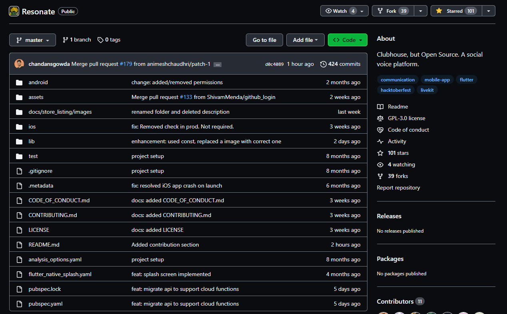
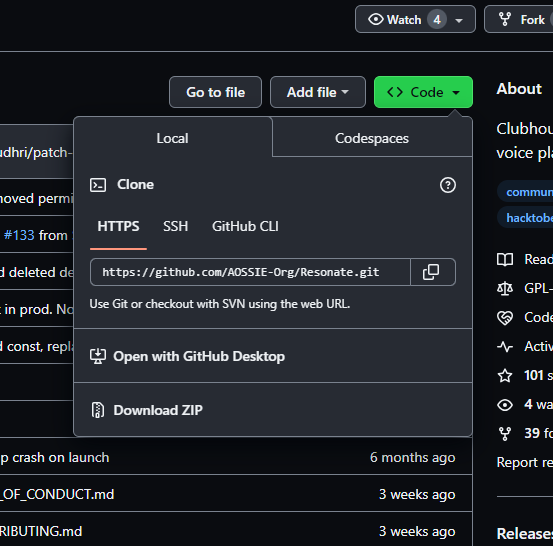
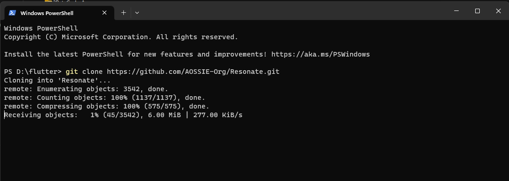
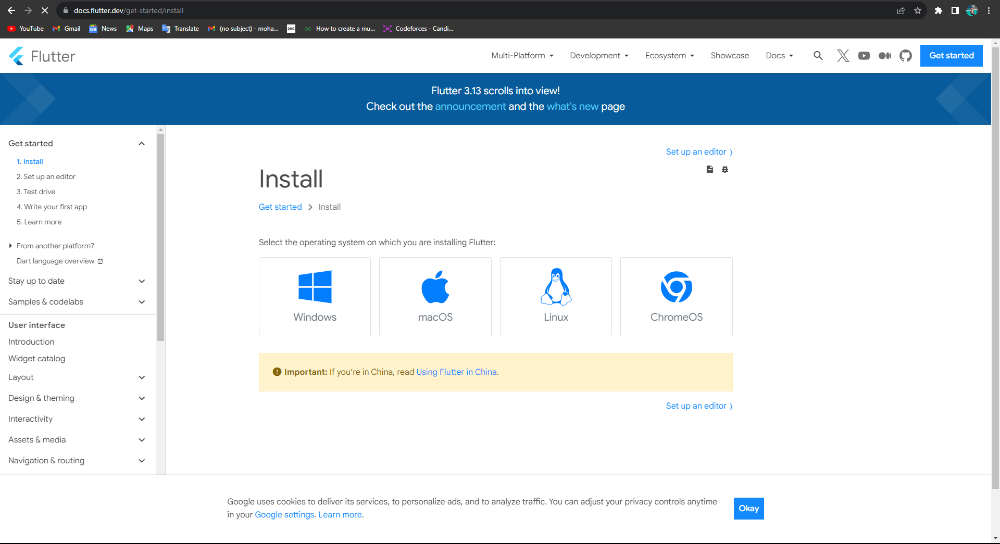
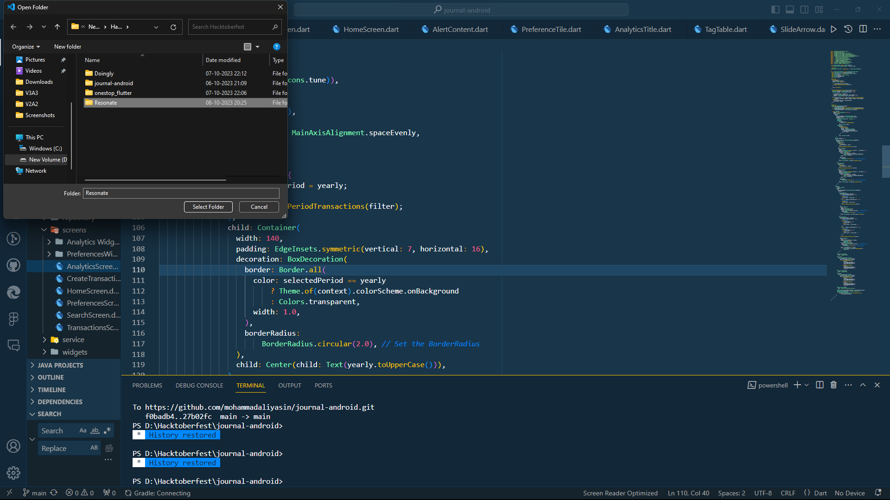
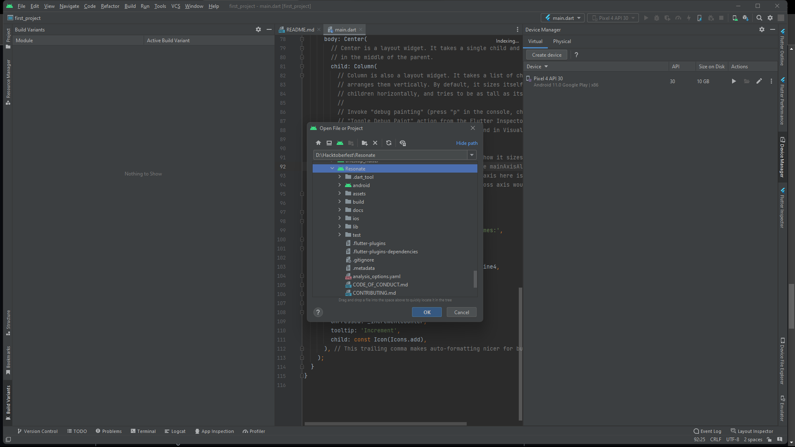

<div align="center">
 <span>
 

 </span>

# :microphone: Resonate - An Open Source Social Voice Platform
</div>
<div align="center"> 
<span>
 <a href="https://appwrite.io" target="_blank"></a> 
 </a>
</span>
</div>
<br>
<br>


<div align="center">
  
[](https://opensource.org/license/gpl-3-0/)


</div>


With the rising popularity of social voice platforms such as Clubhouse and Twitter Spaces, it is high time for an Open Source alternative. A platform like this would not only enhance credibility within the open-source community but also attract more users and foster growth. An engagement platform that is Open Source has the potential to drive significant traction and help establish a strong presence.

## :rocket: Features
1. Real-time Audio Communication by joining rooms and talking to people.
2. Ability to create rooms and moderate speakers and events.
3. Pair chatting to enable users to find random partners to talk to in the app.
4. Real-time messaging(Coming Soon) 

## :computer: Technologies Used

1.  **Flutter** - Mobile application
2.  **Appwrite** - Authentication, Database, Storage and Cloud functions.
3.  **LiveKit** - Web Real-Time Communication 

## :link: Repository Links
1. [Resonate Flutter App](https://github.com/AOSSIE-Org/Resonate)
2. [Resonate Backend](https://github.com/AOSSIE-Org/Resonate-Backend)

## :movie_camera: App Screenshots
<div align="center">
 
| Login Screen | Home Screen | Create Room Screen |
| :---         |     :---      |          :--- |
|   |     |     |

| Room Screen | Profile Screen | Pairchat Screen |
| :---         |     :---      |          :--- |
|   |    |      |
</div>

## :raised_hands: Contributing
### 1. Star and Fork this Repository
###### You can star ⭐ and fork 🍽️ this repository on GitHub by navigating at the top of this repository.




###### GitHub repository URLs will reference both the username associated with the owner of the repository, as well as the repository name. For example,Jaideep Prasad & Chandan S Gowda is the owner of this repository, so the GitHub URL for this project is:

https://github.com/AOSSIE-Org/Resonate

###### When you’re on the main page for the repository, you’ll see a button to "Star" and “Fork” the repository on your upper right-hand side of the page, underneath your user icon.

### 2. Clone the Repository
###### To make your own local copy of the repository you would like to contribute to, let’s first open up a terminal window.
###### We’ll use the git clone command along with the URL that points to your fork of the repository.
###### This URL will be similar to the URL above, except now it will end with .git. In the example above, the URL will look like this:

https://github.com/AOSSIE-Org/Resonate.git

###### You can alternatively copy the URL by using the green “Clone or download” button from your repository page that you just forked from the original repository page. Once you click the button, you’ll be able to copy the URL by clicking the binder button next to the URL:


###### Once we have the URL, we’re ready to clone the repository. To do this, we’ll combine the git clone command with the repository URL from the command line in a terminal window:
```
git clone https://github.com/AOSSIE-Org/Resonate.git
```



### 3. Download Flutter
###### Link to Developers page:https://docs.flutter.dev/get-started/install




### 4. Open the Project
###### After completing the setup for Flutter open the project in VSCode.



 #### You can also do it with android studio



### 5. Create New Branch
###### Once the project is opened create a new branch and checkout in it where you can make the changes in the code.
###### You can do this either from terminal or Directly in VScode.
###### To do from Terminal:
```
git branch new-branch
git checkout new-branch
```

### 6. Commit and Push
###### After making the required changes commit and push your code
###### Terminal:
###### To add the changes after you have made the modifications
``` git add . ``` or ``` git add -A ```
###### To commit and push the changes
```
git commit -m <Your-commit-message>
```
```
git push --set-upstream origin new-branch
```

### 7. Update Local Repository
###### While working on a project alongside other contributors, it is important for you to keep your local repository up-to-date with the project as you don’t want to make a pull request for code that will cause conflicts. To keep your local copy of the code base updated, you’ll need to sync changes.
###### We’ll first go over configuring a remote for the fork, then syncing the fork.

### 8. Configure a Remote for the Fork
###### You’ll have to specify a new remote upstream repository for us to sync with the fork. This will be the original repository that you forked from. you’ll have to do this with the git remote add command.
```
git remote add upstream https://github.com/AOSSIE-Org/Resonate
```
###### In this example, // upstream // is the shortname we have supplied for the remote repository since in terms of Git, “upstream” refers to the repository that you cloned from. If you want to add a remote pointer to the repository of a collaborator, you may want to provide that collaborator’s username or a shortened nickname for the shortname.

### 9. Sync the Fork
###### Once you have configured a remote that references the upstream and original repository on GitHub, you are ready to sync your fork of the repository to keep it up-to-date.
To sync your fork, from the directory of your local repository in a terminal window, you’ll have to use the // git fetch // command to fetch the branches along with their respective commits from the upstream repository. Since you used the shortname “upstream” to refer to the upstream repository, you’ll have to pass that to the command:
``` git fetch upstream ```
###### Switch to the local master branch of our repository:
``` git checkout master ```
###### Now merge any changes that were made in the original repository’s master branch, that you will access through your local upstream/master branch, with your local master branch:
``` git merge upstream/master ```

### 10. Create Pull Request
###### At this point, you are ready to make a pull request to the original repository.
###### Now navigate to your forked repository, and press the “New pull request” button on your left-hand side of the page.

:star: Don't forget to star this repository if you find it useful! :star:

Thank you for considering contributing to this project! Contributions are highly appreciated and welcomed. To ensure a smooth collaboration, Refer to the [Contribution Guidelines](https://github.com/AOSSIE-Org/Resonate/blob/master/CONTRIBUTING.md).

We appreciate your contributions and look forward to working with you to make this project even better!

By following these guidelines, we can maintain a productive and collaborative open-source environment. Thank you for your support!

## :v: Maintainers

-   [Jaideep Prasad](https://github.com/jddeep)
-   [Chandan S Gowda](https://github.com/chandansgowda)

## :mailbox: Communication Channels

If you have any questions, need clarifications, or want to discuss ideas, feel free to reach out through the following channels:

-   [Discord Server](https://discord.com/invite/6mFZ2S846n)
-   [Email](mailto:aossie.oss@gmail.com)

<!-- License -->
## :round_pushpin: License

Distributed under the [GNU General Public License](https://opensource.org/license/gpl-3-0/). See [LICENSE](https://github.com/AOSSIE-Org/Resonate/blob/master/LICENSE) for more information.

## 💪 Thanks To All Contributors

Thanks a lot for spending your time helping Resonate grow. Keep rocking 🥂

<a href="https://github.com/AOSSIE-Org/Resonate/graphs/contributors">
  
</a>
<br>
 

