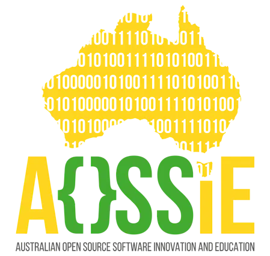

<div align="center">
 <span>
 

 </span>

# :microphone: Resonate - An Open Source Social Voice Platform

</div>
<div align="center" style="text-align:center;"> 
<span>
 <a href="https://appwrite.io" target="_blank">
  <picture>
   <source media="(prefers-color-scheme: dark)" align="center" srcset="https://github.com/appwrite/website/blob/main/static/images/logos/appwrite.svg"      
    alt="Appwrite Logo" width="200">
   
  </picture>
 </a>
 &nbsp;&nbsp;&nbsp;&nbsp;&nbsp;&nbsp;&nbsp;&nbsp;
 <a href="https://livekit.io" target="_blank">
  <picture>
   <source media="(prefers-color-scheme: dark)" align="center" srcset="https://github.com/AKASHANGADII/Resonate/assets/81625153/87bb173f-d5b0-4386-b9ca-6e69cd53578f" alt="Livekit Logo" width="140" height="30">
   
  </picture>
 </a>
</span>
</div>
<br>
<br>

<div align="center">
  
[](https://opensource.org/license/gpl-3-0/)

[](https://play.google.com/store/apps/details?id=com.resonate.resonate)

</div>

With social voice platforms like Spotify, Clubhouse, and Twitter Spaces experiencing rapid growth, Resonate is here to harness the power of open-source for voice-based social media. Whether it's sharing immersive stories, engaging in dynamic live discussions, or connecting through pair chats and voice calls, Resonate is designed to put voice at the center of your social experience. By fostering innovation and growth, this project aims to reach new heights, continually expanding its features and community, all while staying true to the open-source spirit of collaboration and transparency.

## :rocket: Features

1. **Live audio rooms** — join real-time conversations, or create your own and moderate speakers.
2. **Scheduled rooms** — publish a room ahead of time and notify subscribers when it goes live.
3. **In-room chat and polls** — text alongside the audio, plus live polls with voter avatars.
4. **Stories** — listen to and publish multi-chapter audio stories with synced lyrics, browse the
   catalogue, and follow creators for their next release.
5. **Pair chat** — get matched with a random partner for a spontaneous one-to-one conversation.
6. **Friends and voice calls** — add friends, see who's around, and call them directly.
7. **Activity status** — online, do-not-disturb, in-room or invisible, so people know when you're
   reachable.
8. **Speaking indicators** — live waveform rings around the avatar of whoever is talking.
9. **Six themes and ten languages** — light and dark palettes, with the UI localised into English,
   Hindi, Bengali, Marathi, Gujarati, Kannada, Malayalam, Punjabi, Rajasthani and Tamil.

## :computer: Technologies Used

1.  **Flutter** — mobile application (Android and iOS)
2.  **Appwrite** — authentication, database, storage and cloud functions
3.  **LiveKit** — WebRTC real-time audio
4.  **Riverpod** — state management, in an MVVM feature-first architecture
5.  **Firebase Cloud Messaging** — push notifications
6.  **Meilisearch** — search (optional)

## :link: Repository Links

1. [Resonate Flutter App](https://github.com/AOSSIE-Org/Resonate)
2. [Resonate Backend](https://github.com/AOSSIE-Org/Resonate-Backend)

## :books: Documentation

| Document | What it covers |
| --- | --- |
| [ONBOARDING.md](ONBOARDING.md) | Full development setup, including the backend |
| [CONTRIBUTING.md](CONTRIBUTING.md) | How to report issues, open PRs, and structure commits |
| [MAINTAINERS.md](MAINTAINERS.md) | Who reviews and merges changes |
| [AGENTS.md](AGENTS.md) | Repository conventions for AI coding agents |
| [TRANSLATIONS.md](TRANSLATIONS.md) | Adding or improving a translation |
| [brands/Brand.md](brands/Brand.md) | Logo, icons, colour palette and typography |
| [SECURITY.md](SECURITY.md) | Reporting a vulnerability |
| [BestPracticesChecklist.md](BestPracticesChecklist.md) | OpenSSF best-practices self-assessment |

## :four_leaf_clover: Getting Started

Resonate is a broad project that makes use of other software solutions like Appwrite and Livekit, starting up can be a little challenging.

We offer a guide for walking you through setting up the entire project, including a script that automates the set up of the backend environment for you.
Please go through and strictly follow the [Onboarding Guide](https://github.com/AOSSIE-Org/Resonate/blob/master/ONBOARDING.md) for setting up the project for development and further contributions.

Once the backend is up, the client side is standard Flutter:

```bash
flutter pub get
dart run build_runner build --delete-conflicting-outputs   # generated code
flutter run --dart-define=APPWRITE_BASE_DOMAIN=<your-host>
```

Before opening a pull request:

```bash
flutter analyze          # lints
dart run custom_lint     # Riverpod lints — `flutter analyze` does not run these
flutter test             # full test suite
```

## ▶️ Play Store Feature Graphic

<div align="center">


 </div>

## :movie_camera: App Screenshots

<div align="center">
 
| Login Screen (Forest)                                                                                                    | Home Screen (Time)                                                                                                      | Create Room Screen (Time)                                                                                               |
| :----------------------------------------------------------------------------------------------------------------------- | :---------------------------------------------------------------------------------------------------------------------- | :---------------------------------------------------------------------------------------------------------------------- |
|  |  |  |

| Room Screen (Cream)                                                                                                     | Profile Screen (Amber)                                                                                                  | Explore Story (Forest)                                                                                                 |
| :---------------------------------------------------------------------------------------------------------------------- | :---------------------------------------------------------------------------------------------------------------------- | :--------------------------------------------------------------------------------------------------------------------- |
|  |  |  |

| Explore Story (Amber)                                                                                                   | Theme Screen (Vintage)                                                                                                  | Upcoming Room Screen (Cream)                                                                                           |
| :---------------------------------------------------------------------------------------------------------------------- | :---------------------------------------------------------------------------------------------------------------------- | :--------------------------------------------------------------------------------------------------------------------- |
|  |  |  |

</div>

## :raised_hands: Contributing

:star: Don't forget to star this repository if you find it useful! :star:

Thank you for considering contributing to this project! Contributions are highly appreciated and welcomed. (Please contribute to the `dev` branch.) To ensure smooth collaboration, refer to the Contribution Guidelines(https://github.com/AOSSIE-Org/Resonate/blob/master/CONTRIBUTING.md).

We appreciate your contributions and look forward to working with you to make this project even better!

By following these guidelines, we can maintain a productive and collaborative open-source environment. Thank you for your support!

## :v: Maintainers

- [Chandan S Gowda](https://github.com/chandansgowda)
- [Madhav Gupta](https://github.com/M4dhav)
- [Mayank](https://github.com/Mayank4352)

See [MAINTAINERS.md](MAINTAINERS.md) for what maintainers do and how to get a review.

## :mailbox: Communication Channels

If you have any questions, need clarifications, or want to discuss ideas, feel free to reach out through the following channels:

-   [Discord Server](https://discord.gg/MMZBadkYFm)
-   [Email](mailto:aossie.oss@gmail.com)


<!-- License -->

## :round_pushpin: License

Distributed under the [GNU General Public License](https://opensource.org/license/gpl-3-0/). See [LICENSE](https://github.com/AOSSIE-Org/Resonate/blob/master/LICENSE) for more information.

## 💪 Thanks To All Contributors

Thanks a lot for spending your time helping Resonate grow. Keep rocking 🥂

<a href="https://github.com/AOSSIE-Org/Resonate/graphs/contributors">
  
</a>
<br>
